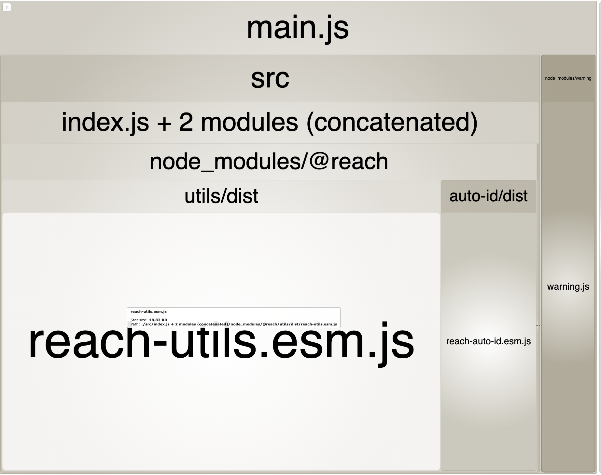

To start the bundle analyzer:

```bash
yarn
yarn analyze
```

You can see all of `@reach/utils` is included in the bundle even though we use only 1 of the exports.



Editing `node_modules/@reach/utils/package.json` and adding `sideEffects: false` makes no difference.

